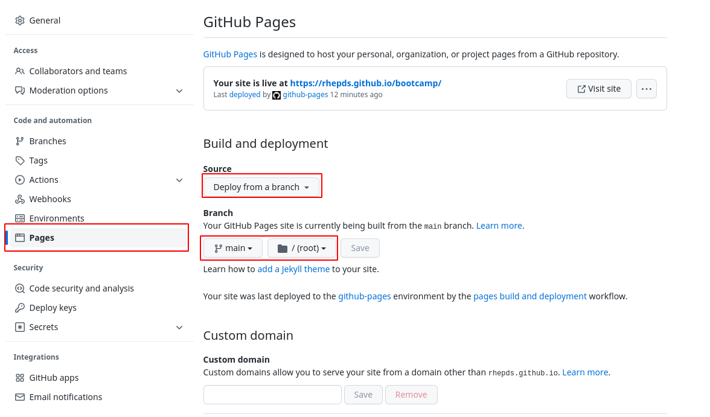

# How to create additional content pages

## Prepare your repository for content generation

We use the just-the-docs jekyll theme for our webpages. 
To add a page to this home page you need to do the following:

1. In your repository add the file [`_config.yml`](https://raw.githubusercontent.com/RHEPDS/rhepds.github.io/main/_config.yml):
	```
	title: Title of your course here
	description: Short description (optional)
	url: "http://rhepds.github.io/your-repo-name-here"
	markdown: kramdown
	remote_theme: just-the-docs/just-the-docs
	logo: "img/rhepds.png"
	aux_links:
	  "Main Page":
	    - "//rhepds.github.io"
	  "Red Hat EMEA Partner":
	    - "//www.redhat-partner.com"
	aux_links_new_tab: true
	```
2. Edit title, description and url in `_config.yml` to point to your repository
3. copy `img/rhpds.png` from [here](https://github.com/RHEPDS/rhepds.github.io) to your repository
4. Add the link to your repository to the [`README.md`](https://github.com/RHEPDS/rhepds.github.io/blob/main/README.md)

A full documention and more options for the `_config.yml` file can be found [here](https://just-the-docs.github.io/just-the-docs/docs/configuration/). 

If you have more than one .md file in your repository you need to add a header to each .md-file.
The headers need to look like this:

The main page:

```
---
layout: default
title: Home
nav_order: 0
has_children: true
permalink: /
---
```
- **layout: default** don't change unless you know what you do.
- **permalink: /** defines that this is the main-page. Only define this on the main-page.
- **nav_order:** defines the order where the mdfile is listed in the left navigation bar. 
- **title:** text in the left navigation bar.
- **has_children: true** If you have subpages set this value.

If you use subpages, you need to have the following syntax

```
---
layout: default
title: subpage
nav_order: 0
parent: Home
---
```

- **parent:** On the subpage  enter the title of the parent page here

The other parameters are identical. 

## Activate Auto-generation of your page

Once you have created `_config.yaml`, copied the logo and optionally added the headers to your .md files, you need to enable the autogeneration of that page, whenever you create new content.

1. Browse to the homepage of you repository, e.g. https://github.com/RHEPDS/bootcamp and click on `Settings`
2. Click on Pages and select the following parameters
	- **Source:**: Deploy from a branch
	- **Branch**: select `main` and `/(root)` 
	- Click on `Save`



From now on your pages are rebuild at every commit to your main branch. You can see the log at the `Actions` tab on your repository.


